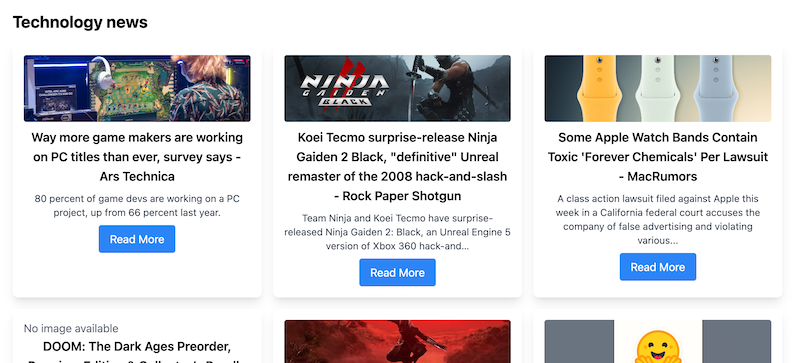

# News API Web Application

A Next.js web application that displays the latest news from any category using the NewsAPI service. Default category is set to technology.



## Features

- Display latest news articles from configurable categories
- Responsive grid layout
- Article cards with images, titles, and descriptions
- "Read More" links to original articles
- Dynamic page title and heading based on selected category

## Setup

1. Clone the repository
2. Install dependencies:
```bash
npm install
```

3. Create a `.env.local` file in the root directory with the following variables:
```
NEXT_PUBLIC_NEWS_API_KEY=your_api_key_here
NEXT_PUBLIC_NEWS_API_URL=https://newsapi.org/v2/top-headlines
NEXT_PUBLIC_NEWS_CATEGORY=technology  # Change this to any category you want
```

4. Run the development server:
```bash
npm run dev
```

5. Open [http://localhost:3000](http://localhost:3000) in your browser

## Technologies

- Next.js
- React
- Tailwind CSS
- NewsAPI

## License

MIT 